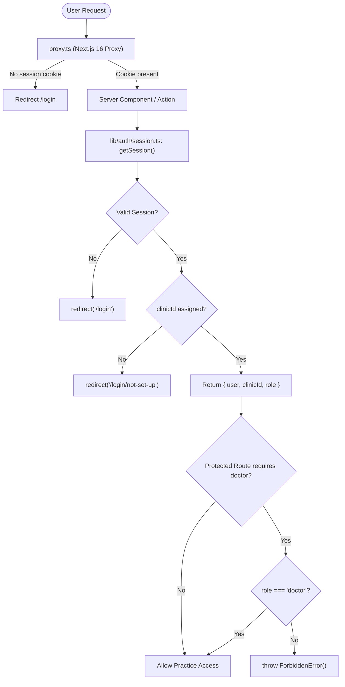

# Implementation Plan — Phase 2: Authentication

Complete the authentication infrastructure for CliniCare using **Better Auth**, **Next.js 16 App Router**, and **Drizzle ORM**, fulfilling all requirements from `docs/PRD.md §8.1`, `docs/ARCHITECTURE.md §2-3, §6`, and `docs/ROADMAP.md §2`.

---

## 1. Goal Description

Establish an authoritative, multi-tenant authentication and authorization layer:
1. Mount the Better Auth request handler at `/api/auth/[...all]`.
2. Provide a typed browser client in `lib/auth/client.ts` with real OAuth integration in `<LoginView>`.
3. Implement authoritative server-side session resolution in `lib/auth/session.ts` (`getSession()`) enforcing:
   - Redirect to `/login` if unauthenticated.
   - Redirect to `/login/not-set-up` if the user is not provisioned with a `clinicId` (`docs/PRD.md §8.1`).
   - Return strongly-typed `{ user: { id, name, email }, clinicId, role }` for valid accounts.
4. Implement doctor-only route and action gating in `lib/auth/require-doctor.ts` (`requireDoctor()`), throwing `ForbiddenError` when accessed by non-doctors.
5. Implement Next.js 16 soft cookie-presence redirect proxy in `proxy.ts` at the project root for protected app routes (`/dashboard`, `/patients`, `/appointments`).
6. Deliver full Vitest unit test coverage for session resolution and doctor role enforcement with zero DOM testing dependencies.



---

## 2. User Review Required

> [!IMPORTANT]
> **Next.js 16 Proxy Convention**: Next.js 16 replaces `middleware.ts` with `proxy.ts` at the project root (`export function proxy(request: NextRequest)`). This plan uses the official Next.js 16 `proxy.ts` convention matching `docs/ROADMAP.md §2.3`.

> [!NOTE]
> **Account Provisioning Guard**: Consistent with `docs/PRD.md §8.1` and `components/login-not-set-up-view.tsx`, authenticated users without an assigned `clinicId` are redirected to `/login/not-set-up`. In addition, `ClinicNotAssignedError` and `ForbiddenError` are formally exported for structured server-side exception handling.

---

## 3. Open Questions

None. Architecture and requirements are fully locked in `docs/PRD.md` and `docs/ARCHITECTURE.md`.

---

## 4. Proposed Changes

### Component 1: Better Auth Configuration & Route Handlers

#### [MODIFY] `lib/auth/auth.ts`
- Add `nextCookies` plugin from `better-auth/next-js` to ensure cookies propagate correctly across Server Actions.

```ts
import { betterAuth } from "better-auth";
import { drizzleAdapter } from "better-auth/adapters/drizzle";
import { nextCookies } from "better-auth/next-js";
import { db } from "@/lib/db/client";

export const auth = betterAuth({
  database: drizzleAdapter(db, {
    provider: "pg",
  }),
  socialProviders: {
    github: {
      clientId: process.env.GITHUB_CLIENT_ID || "",
      clientSecret: process.env.GITHUB_CLIENT_SECRET || "",
    },
    google: {
      clientId: process.env.GOOGLE_CLIENT_ID || "",
      clientSecret: process.env.GOOGLE_CLIENT_SECRET || "",
    },
  },
  user: {
    additionalFields: {
      clinicId: {
        type: "string",
        required: false,
      },
      role: {
        type: "string",
        required: false,
        defaultValue: "doctor",
      },
    },
  },
  plugins: [nextCookies()],
});

export type Auth = typeof auth;
```

#### [NEW] `app/api/auth/[...all]/route.ts`
- Mount Better Auth endpoint handlers using `toNextJsHandler(auth)`.

```ts
import { auth } from "@/lib/auth/auth";
import { toNextJsHandler } from "better-auth/next-js";

export const { GET, POST } = toNextJsHandler(auth);
```

#### [NEW] `lib/auth/client.ts`
- Browser client using `createAuthClient` from `better-auth/react`.

```ts
import { createAuthClient } from "better-auth/react";

export const authClient = createAuthClient();

export const { signIn, signOut, useSession } = authClient;
```

---

### Component 2: Auth Errors, Session Resolution & Role Guards

#### [NEW] `lib/auth/errors.ts`
- Centralized auth domain exceptions.

```ts
export class ForbiddenError extends Error {
  constructor(message = "Forbidden: Doctor role required") {
    super(message);
    this.name = "ForbiddenError";
  }
}

export class ClinicNotAssignedError extends Error {
  constructor(message = "Account not set up: No clinic assigned") {
    super(message);
    this.name = "ClinicNotAssignedError";
  }
}
```

#### [NEW] `lib/auth/session.ts`
- The authoritative single source of truth for session and multi-tenant clinic resolution.

```ts
import { headers } from "next/headers";
import { redirect } from "next/navigation";
import { auth } from "@/lib/auth/auth";
import { ClinicNotAssignedError } from "@/lib/auth/errors";

export type UserRole = "doctor" | "receptionist";

export interface SessionContext {
  user: {
    id: string;
    name: string;
    email: string;
  };
  clinicId: string;
  role: UserRole;
}

export async function getSession(): Promise<SessionContext> {
  const reqHeaders = await headers();
  const session = await auth.api.getSession({
    headers: reqHeaders,
  });

  if (!session || !session.user) {
    redirect("/login");
  }

  const user = session.user as typeof session.user & {
    clinicId?: string | null;
    role?: string | null;
  };

  if (!user.clinicId) {
    redirect("/login/not-set-up");
  }

  return {
    user: {
      id: user.id,
      name: user.name,
      email: user.email,
    },
    clinicId: user.clinicId,
    role: (user.role as UserRole) || "doctor",
  };
}
```

#### [NEW] `lib/auth/require-doctor.ts`
- Server-side role guard for doctor-restricted routes (e.g. consultations, prescriptions).

```ts
import { getSession, type SessionContext } from "@/lib/auth/session";
import { ForbiddenError } from "@/lib/auth/errors";

export async function requireDoctor(): Promise<SessionContext> {
  const session = await getSession();
  if (session.role !== "doctor") {
    throw new ForbiddenError();
  }
  return session;
}
```

---

### Component 3: Next.js 16 Soft Redirect Proxy

#### [NEW] `proxy.ts` (Project Root)
- Cookie-presence check at request boundary bouncing unauthenticated users to `/login`.

```ts
import { NextRequest, NextResponse } from "next/server";
import { getSessionCookie } from "better-auth/cookies";

export function proxy(request: NextRequest) {
  const sessionCookie = getSessionCookie(request);

  if (!sessionCookie) {
    const loginUrl = request.nextUrl.clone();
    loginUrl.pathname = "/login";
    if (request.nextUrl.pathname !== "/dashboard") {
      loginUrl.searchParams.set("callbackUrl", request.nextUrl.pathname);
    }
    return NextResponse.redirect(loginUrl);
  }

  return NextResponse.next();
}

export const config = {
  matcher: [
    "/dashboard",
    "/dashboard/:path*",
    "/patients",
    "/patients/:path*",
    "/appointments",
    "/appointments/:path*",
  ],
};
```

---

### Component 4: Login View Integration

#### [MODIFY] `components/login-view.tsx`
- Replace mock `setTimeout` with `authClient.signIn.social({ provider, callbackURL: "/dashboard" })`.
- Ensure Shadcn primitives (`<Button>`, `<Badge>`) continue to be used.
- Add error banner when OAuth handshake or redirect fails.

```tsx
import { authClient } from "@/lib/auth/client";
...
const handleOAuthSignIn = async (provider: "github" | "google") => {
  setLoadingProvider(provider);
  setErrorMessage(null);
  try {
    await authClient.signIn.social({
      provider,
      callbackURL: "/dashboard",
    });
  } catch (err: unknown) {
    setLoadingProvider(null);
    setErrorMessage("Unable to initiate authentication. Please check your network and credentials.");
  }
};
```

---

### Component 5: Unit Tests

#### [NEW] `lib/auth/__tests__/session.test.ts`
Unit tests with mocked `next/headers`, `next/navigation`, and `auth.api.getSession`:
1. **Unauthenticated:** Assert `getSession()` redirects to `/login` when session is absent.
2. **Unprovisioned Clinic:** Assert `getSession()` redirects to `/login/not-set-up` (or signals not set up) when `clinicId` is missing/empty.
3. **Valid Session:** Assert `getSession()` returns resolved `{ user, clinicId, role }` for clinic-linked doctor and receptionist users.

#### [NEW] `lib/auth/__tests__/require-doctor.test.ts`
Unit tests with mocked `session.ts`:
1. **Doctor Access:** Assert `requireDoctor()` returns session for `role: "doctor"`.
2. **Receptionist Access:** Assert `requireDoctor()` throws `ForbiddenError` for `role: "receptionist"`.

---

## 5. Verification Plan

### Automated Tests
Run pure logic unit tests via Vitest:
```bash
pnpm test
```
Verify that all tests in `lib/db/__tests__/` and `lib/auth/__tests__/` execute cleanly and pass.

### Production Build Verification
Ensure Next.js 16 compiles all endpoints, `proxy.ts`, and pages with no type or bundling errors:
```bash
pnpm build
```

### Manual Verification
1. Visit `http://localhost:3000/dashboard` in an incognito window without auth cookie -> proxy redirects to `/login?callbackUrl=%2Fdashboard`.
2. Sign in via `/login` -> triggers Better Auth social provider flow.
3. Verify `/login/not-set-up` renders the unassigned clinic notice cleanly.
