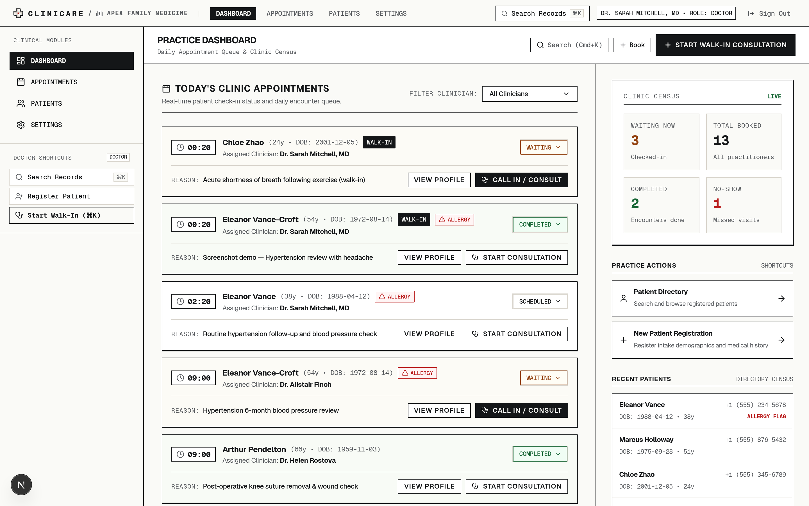
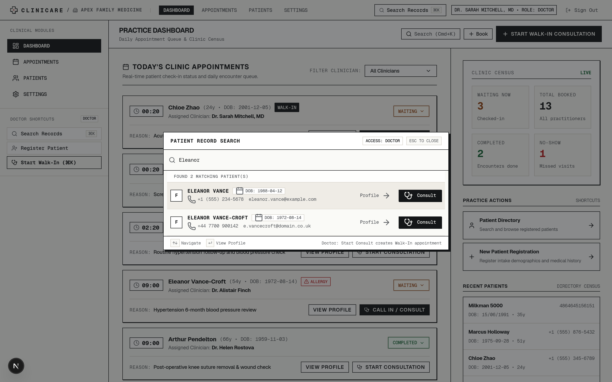
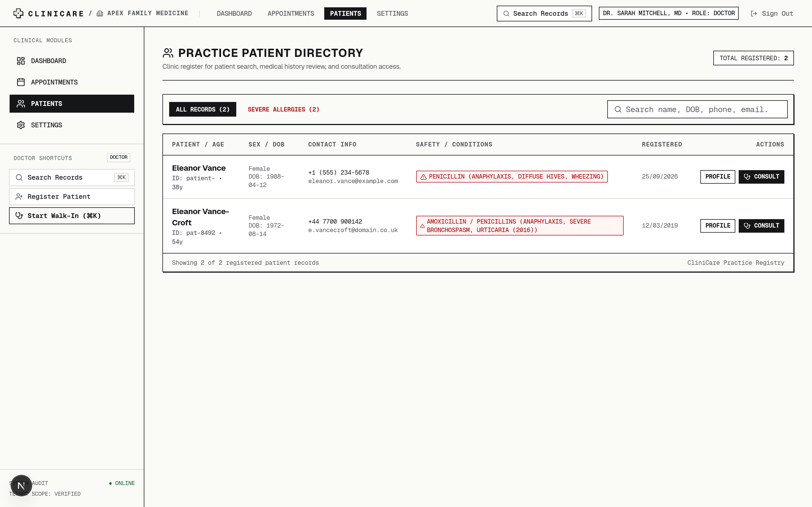
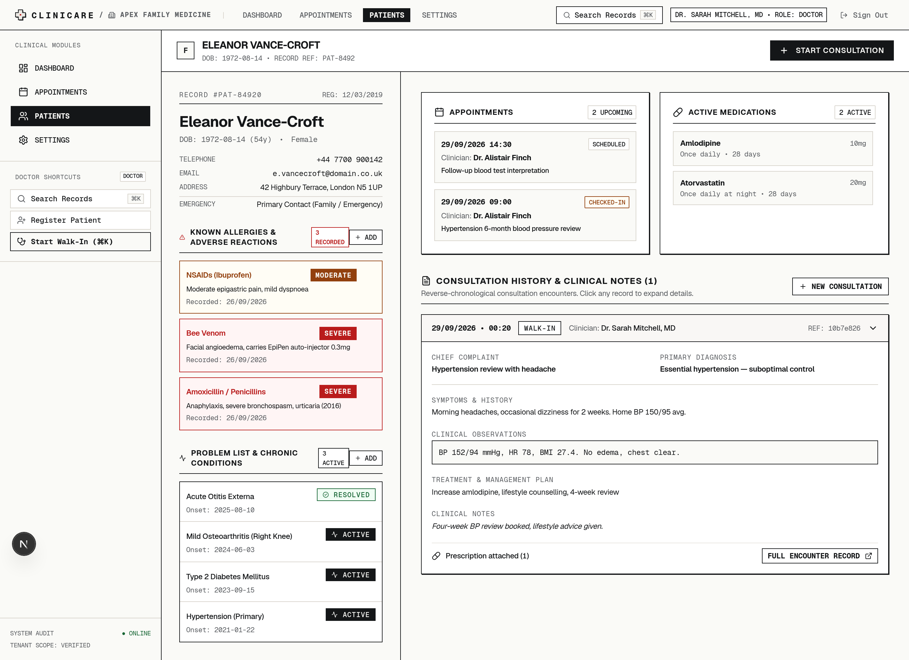
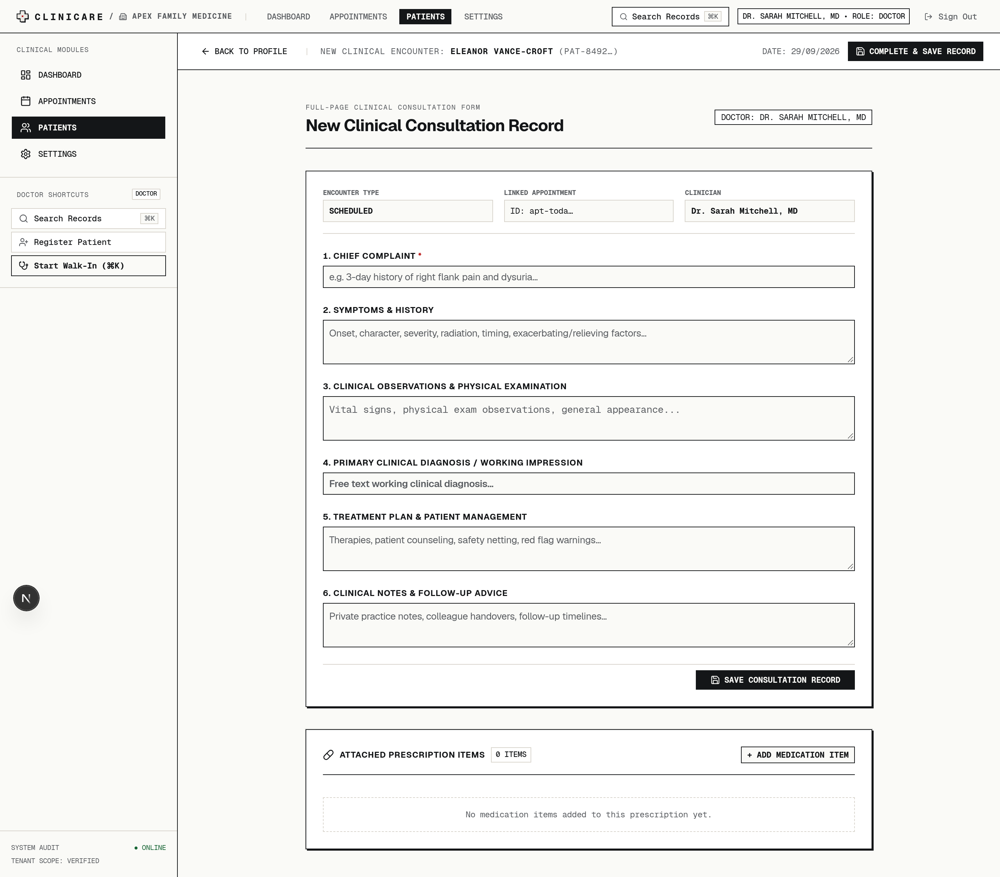
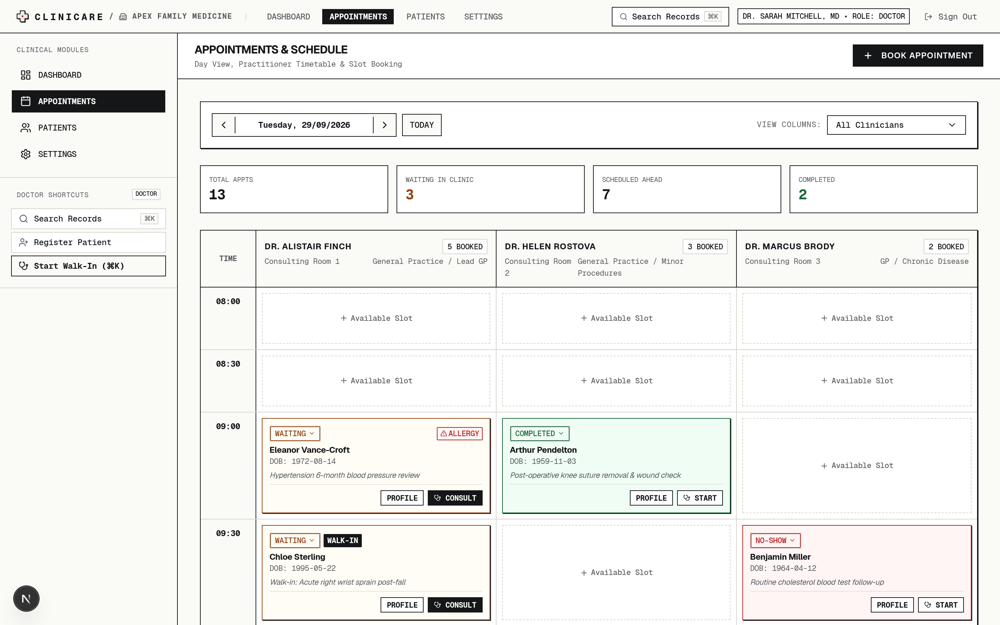
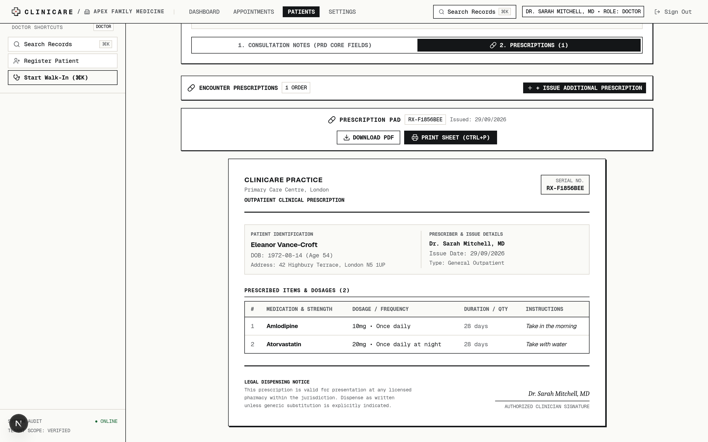

# C L I N I C A R E

<p align="center">
  <strong>Focused Practice Management for Solo Practitioners & Small Clinics</strong><br>
  <em>"The Pathology Lab Report" design system. Zero EMR overhead. Instant patient lookup to prescription in under 60 seconds.</em>
</p>

<p align="center">
  <a href="#3-architectural--multi-tenancy-invariants"></a>
  <a href="#3-architectural--multi-tenancy-invariants"></a>
  <a href="#4-tech-stack"></a>
  <a href="#4-tech-stack"></a>
  <a href="#4-tech-stack"></a>
  <a href="#4-tech-stack"></a>
  <a href="#5-getting-started--local-development"></a>
</p>

---

<p align="center">
  
</p>

---

## 1. Overview & "The Pathology Lab Report" Philosophy

**CliniCare** is a practice-management web application engineered for individual doctors and small multi-doctor clinics (1–5 practitioners). It captures the vital clinical loop — patient identification, appointment management, consultation charting, and prescription issuance — without the suffocating overhead of hospital EMRs, complex billing, or enterprise bureaucracy.

Rather than assembling a generic SaaS dashboard with clinical data bolted on, CliniCare's interface is conceived as an extension of the clinician's diagnostic instrument, adhering to the design tenets in [`DESIGN.md`](DESIGN.md):

- **The Pathology Lab Report Aesthetic**: High-contrast carbon ink (`#141618`) on warm, glare-free form paper (`#FAFAF7`). Flat tonal layering with crisp 1px structural rules. Zero decorative gradients, glassmorphism, or frivolous consumer animations.
- **Persistent 30/70 Clinical Topology**: A sticky 30% left column locks critical patient identity, life-threatening allergies, and active problems into permanent view. The 70% right canvas hosts chronological encounter narratives and visit records.
- **Diagnostic Color Parsimony**: 95% neutral ground. Saturated color is strictly rationed for clinical gravity: Critical Flag Red (`#B91C1C`) for anaphylaxis contraindications, Warning Amber (`#D97706`) for sensitivities, and Resolved Green (`#166534`) for cleared conditions.
- **Tabular Precision**: Monospaced tabular numerals (`tnum`) across all clinical measurements, blood pressure readings, dosages, and European standard dates (`DD/MM/YYYY`) to eliminate reading errors under surgery pressure.

---

## 2. Core Workflows & Media Showcase

### Flow 1 — Practice Hub & Command Velocity
> Morning huddle command center showing real-time appointment queues and clinical status, paired with a global `⌘K` command palette for instant patient search and zero-friction walk-in triage.

<table width="100%">
  <tr>
    <td width="50%" valign="top">
      
      <p align="center"><sub><strong>Practice Hub:</strong> At-a-glance operational overview showing today's patient queue, active visit statuses, and immediate consultation triggers.</sub></p>
    </td>
    <td width="50%" valign="top">
      
      <p align="center"><sub><strong>Global Command Palette (<code>⌘K</code>):</strong> Instant lookup across names, DOBs, and NHS numbers, with one-stroke walk-in appointment creation.</sub></p>
    </td>
  </tr>
</table>

---

### Flow 2 — Patient Directory & Longitudinal Clinical Chart
> High-density searchable patient roster paired with the two-column clinical chart: permanent allergy flags and chronic condition ledger anchored on the left, chronological timeline on the right.

<table width="100%">
  <tr>
    <td width="50%" valign="top">
      
      <p align="center"><sub><strong>Patient Directory:</strong> Tabular roster optimized for rapid scanning with real-time filtering, age calculation, and contact points.</sub></p>
    </td>
    <td width="50%" valign="top">
      
      <p align="center"><sub><strong>Clinical Chart:</strong> 30% persistent column with high-visibility allergy severity chips (`#B91C1C`), problem list, and past encounter history.</sub></p>
    </td>
  </tr>
</table>

---

### Flow 3 — 30-Second Encounter Note & Daily Appointment Schedule
> Dedicated full-page encounter workspace — never a cramped modal — capturing chief complaints, structured diagnoses, and clinical narratives beside time-blocked daily scheduling.

<table width="100%">
  <tr>
    <td width="50%" valign="top">
      
      <p align="center"><sub><strong>Encounter Documentation:</strong> Distraction-free full-page consultation flow with symptom breakdown, clinical notes, and prescription linking.</sub></p>
    </td>
    <td width="50%" valign="top">
      
      <p align="center"><sub><strong>Daily Schedule:</strong> Real-time schedule grid tracking check-in lifecycle transitions (Scheduled → Arrived → In Consultation → Completed).</sub></p>
    </td>
  </tr>
</table>

---

### Flow 4 — Prescription Authoring & Printable Vector Rx
> Multi-item prescription orders with itemized dosage instructions, quantity limits, and one-click printable vector PDF slip generation.

<p align="center">
  
</p>
<p align="center">
  <sub><strong>Printable Rx Engine:</strong> Itemized medication orders authored directly during consultation, rendered into clean vector PDFs via <code>@react-pdf/renderer</code> with clinic letterhead, doctor credentials, and signature block.</sub>
</p>

---

## 3. Architectural & Multi-Tenancy Invariants

CliniCare enforces strict boundaries documented in [`docs/ARCHITECTURE.md`](docs/ARCHITECTURE.md):

1. **Strict Multi-Tenancy Isolation**: Every query and mutation touching clinical records (`patients`, `appointments`, `consultations`, `prescriptions`, `allergies`, `problems`) explicitly receives and filters by `clinic_id`. Cross-clinic data leakage is impossible by design.
2. **Two-Role Hard Separation**:
   - **Doctor (`role: doctor`)**: Unrestricted clinical documentation — patient profiles, medical problems, allergies, consultation encounters, and itemized prescription authoring.
   - **Receptionist (`role: receptionist`)**: Front-desk operations — patient registration and appointment scheduling. Receptionists are barred from clinical consultation and prescription routes at the server layer (`lib/auth/guards.ts`), not merely in the UI.
3. **Thin Route Orchestration**: Next.js App Router routes (`app/`) act solely as thin orchestrators. Business logic and database access are strictly encapsulated in feature modules (`features/<domain>/{queries,mutations}.ts`).
4. **Soft-Delete Clinical Safety**: Patient charts and medical records are soft-deleted via `deleted_at` timestamps. Medical history is never hard-deleted.
5. **Full-Page Consultations**: Clinical encounters require deep physician focus and are presented as dedicated full-page routes — never trapped within modal windows.

---

## 4. Tech Stack

| Layer | Technology | Details |
| :--- | :--- | :--- |
| **Framework** | [Next.js 16.3](https://nextjs.org/) | App Router, Turbopack, Server Actions, React Server Components |
| **UI Library** | [React 19.2](https://react.dev/) | Concurrent React, modern action hooks |
| **Styling** | [Tailwind CSS v4](https://tailwindcss.com/) + [Shadcn UI](https://ui.shadcn.com/) | Lab report token system, Base UI primitives, Lucide icons |
| **Database & ORM** | [Supabase Postgres](https://supabase.com/) & [Drizzle ORM](https://orm.drizzle.team/) | Drizzle Kit migrations, type-safe schema definitions, Drizzle Zod |
| **Authentication** | [Better Auth 1.7](https://www.better-auth.com/) | Role-based sessions (Doctor/Receptionist), OAuth & sandbox switching |
| **Validation** | [React Hook Form](https://react-hook-form.com/) & [Zod 4](https://zod.dev/) | Client and server-side clinical schema validation |
| **Document Engine** | [`@react-pdf/renderer`](https://react-pdf.org/) | Vector PDF generation for prescription slips |
| **Testing** | [Vitest](https://vitest.dev/) | Pure-logic unit and integration test suite (239 tests passing) |

---

## 5. Getting Started & Local Development

### Prerequisites

- Node.js 20+
- pnpm 12+ (`corepack enable pnpm`)
- Postgres database (Supabase or local instance)

### Installation

1. **Clone repository & install dependencies**:
   ```bash
   git clone https://github.com/darkside1337/clinicare.git
   cd clinicare
   pnpm install
   ```

2. **Configure environment variables in `.env.local`**:
   ```env
   DATABASE_URL="postgres://postgres:[PASSWORD]@[HOST]:[PORT]/[DB]"
   BETTER_AUTH_SECRET="your-auth-secret-here"
   BETTER_AUTH_URL="http://localhost:3000"
   NEXT_PUBLIC_APP_URL="http://localhost:3000"
   ```

3. **Run database migrations and seed baseline data**:
   ```bash
   pnpm db:generate
   pnpm db:migrate
   pnpm db:seed
   ```

4. **Launch development server**:
   ```bash
   pnpm dev
   ```
   Open [http://localhost:3000](http://localhost:3000) to access the landing page and sandbox staff switchers.

---

## 6. Demo Sandbox & Development Scripts

The application includes safe sandbox personas (Dr. Sarah Chen, Receptionist James Wilson) for local evaluation and automated testing.

| Command | Description |
| :--- | :--- |
| `pnpm dev` | Starts Next.js development server with Turbopack |
| `pnpm build` | Builds optimized production bundle |
| `pnpm test` | Runs the Vitest test suite (`31 test files, 239 tests`) |
| `pnpm test:watch` | Runs test runner in interactive watch mode |
| `pnpm db:generate` | Generates SQL migrations from Drizzle schema |
| `pnpm db:migrate` | Applies schema migrations to target database |
| `pnpm db:seed` | Populates database with sample clinic, staff personas, and patients |
| `pnpm db:reset-demo` | Truncates and resets demo database (guarded by `DEMO_MODE=true`) |

---

## 7. Architecture & Documentation

- [`docs/ROADMAP.md`](docs/ROADMAP.md) — Phased task breakdown and milestone progress
- [`docs/ARCHITECTURE.md`](docs/ARCHITECTURE.md) — Multi-tenancy boundaries, module structure, and Server Actions patterns
- [`docs/PRD.md`](docs/PRD.md) — Clinical requirements, domain models, and feature specifications
- [`DESIGN.md`](DESIGN.md) — "The Pathology Lab Report" visual design tokens, typography, and layout rules
- [`PRODUCT.md`](PRODUCT.md) — Product positioning, operational principles, and personas
